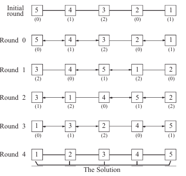

<!-- Readme is written in Markdown. Please refer to PDF folder for rendered ones -->
# Alternate Sorting Algorithm

## Modules Used
- Threading
- Queues

## Installation
0. Ensure you have Python installed

## Usage

```bash
$ python alt_algo.py
Number of Elements
4
Threads finished
Time taken:0.00547409057617 sec
Original: [18389, 53655, 11534, 56416]
Sorted: [11534, 18389, 53655, 56416]

# Directly with number
$ python alt_algo.py -num 10
Threads finished
Time taken:0.0149748325348 sec
Original: [48598, 88803, 29697, 53286, 7167, 86197, 55214, 64730, 93261, 70855]
Sorted: [7167, 29697, 48598, 53286, 55214, 64730, 70855, 86197, 88803, 93261]

# Help
$ python alt_algo.py -h
usage: alt_algo.py [-h] [-d] [-v] [-num NUM]

Alternate n-1 sorting algorithm

optional arguments:
  -h, --help     show this help message and exit
  -d, --details  Shows detailed description of classes
  -v, --verbose  prints the intermediate stages. Can take time to print
  -num NUM       Total number of elements

```

## Explanation


- Flags are assigned based on their ID modulo 3 and is incremented after each round with modulo 3
- Whenever flag = 1 is found, it receives message from both side processes if it has any, does computation and assigns value based on the order.
- Round is said to completed after the flag = 1 process has completed its computation and assigns its neighnouring processes its value.
- This continues for n-1 rounds where n is number of elements.

## References
- [Paper](https://www.researchgate.net/publication/224145793_An_alternative_time_-_Optimal_distributed_sorting_algorithm_on_a_line_network)
- [Threading](https://docs.python.org/3/library/threading.html)
